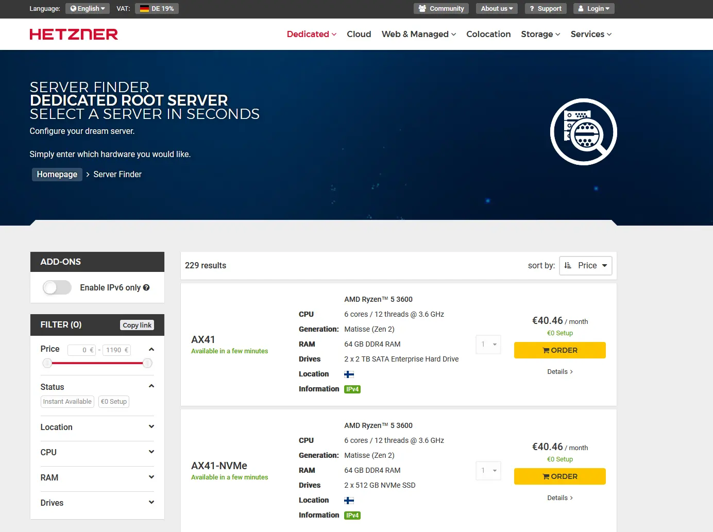
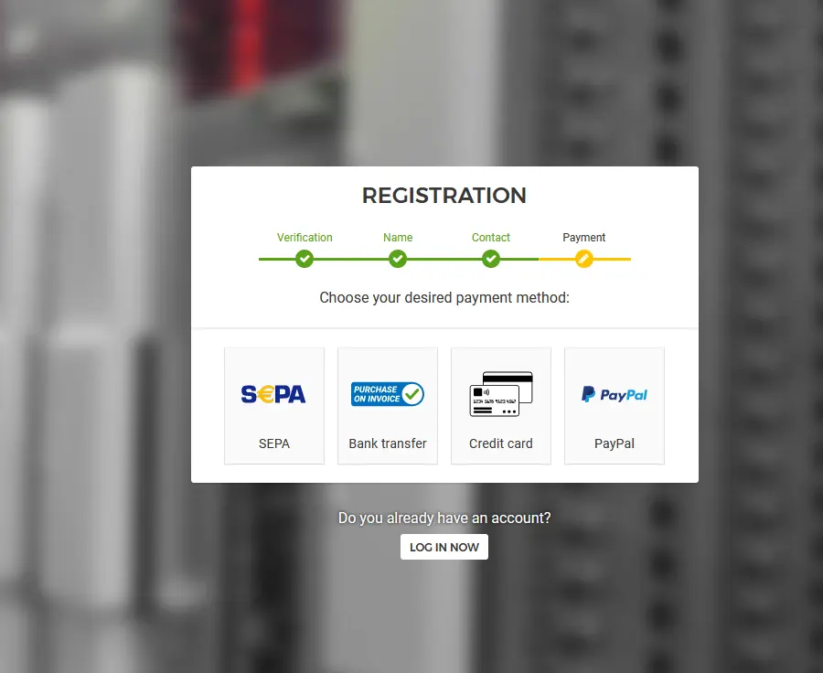
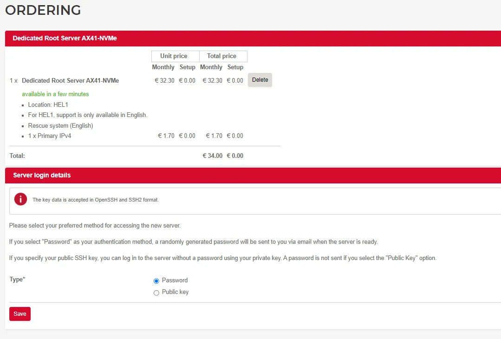
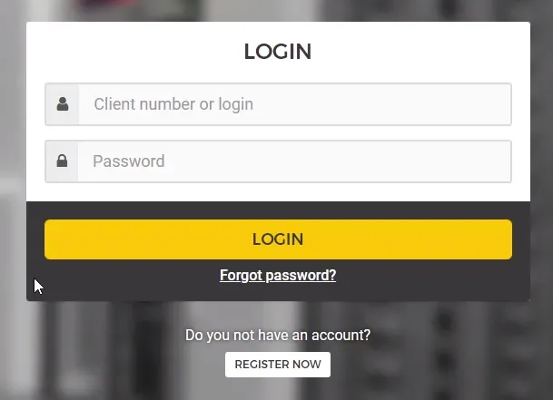
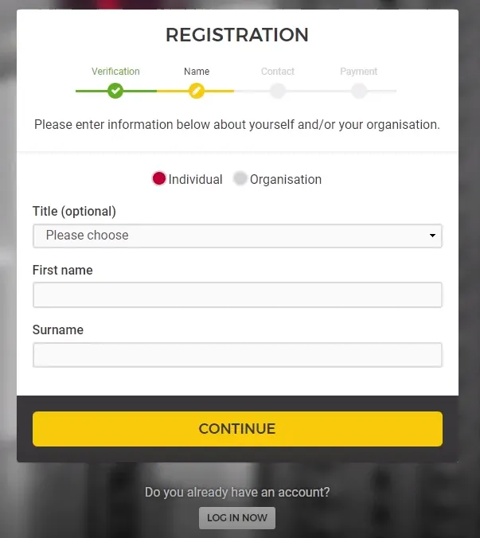
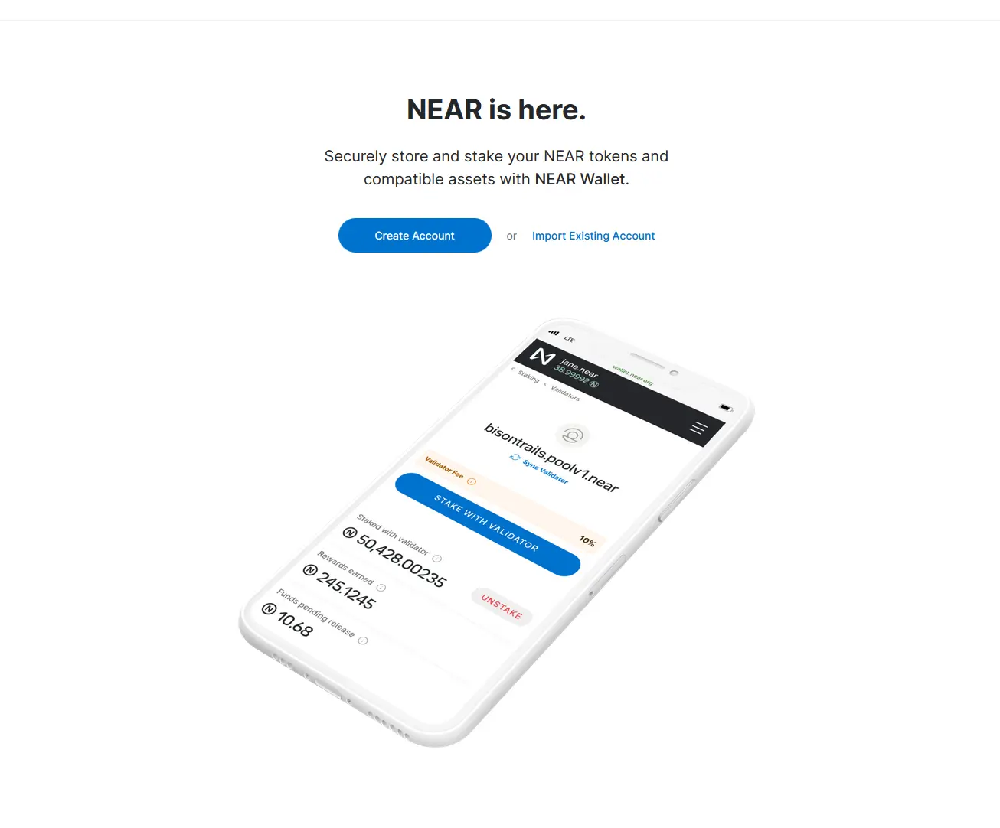
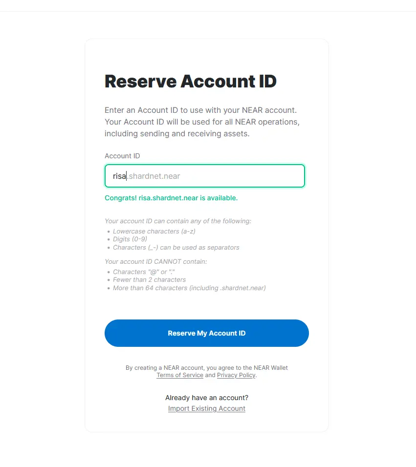
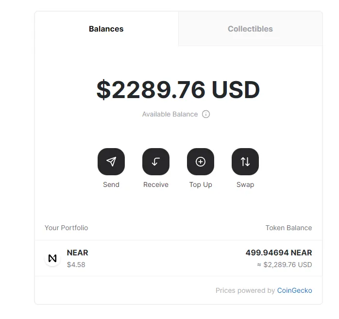
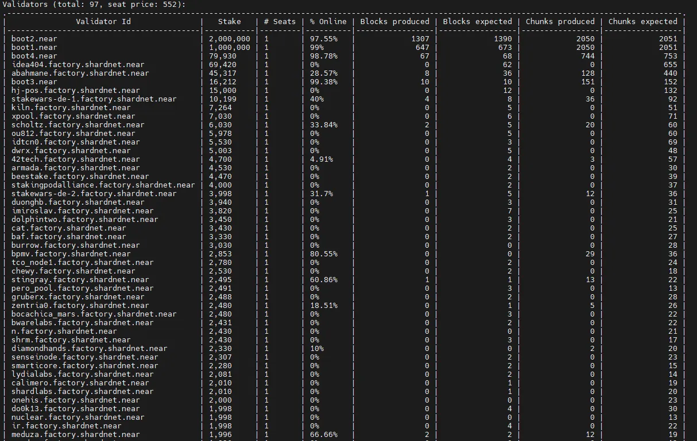

**Langkah I - Pesan server khusus**

Setelah menguji dan menggali, saya menemukan bahwa Hetzner adalah salah satu layanan terbaik di antara para pesaingnya

Tautan
| | |
| ------------------------------------- | ------------------------|
|Dompet | [https://wallet.shardnet.near.org/] |
|Penjelajah | [https://explorer.shardnet.near.org/] |
|Hetzner | [https://www.hetzner.com/] |


**Apa yang kita butuhkan?**
| | |
| ------------------------------------- | ------------------------|
|Kartu Kredit atau PayPal dengan uang| Rp.500.000 |
|Server, petunjuk di bawah| |
|Dan sebuah program untuk mengelola server kita dari jarak jauh| |


| | |
| ------------------------------------- | ------------------------|
|MobaXterm | [https://mobaxterm.mobatek.net/]
|PuTTY |- [https://www.putty.org/]

LANGKAH I Daftar, dan pesan dedicated server
Untuk memulainya, Anda perlu membeli server

**Dalam Tantangan (005)[https://github.com/near/stakewars-iii/blob/main/challenges/005.md] Anda dapat memilih dari layanan berikut**

* Amazon Web Services
* Google Cloud Platform
* Microsoft Azure
* IBM Cloud
* DigitalOcean
* Hetzner

Kami akan menunjukkan kepada Anda contoh (Hetzner)[https://www.hetzner.com/]

## Persyaratan Server
1. Memilih server Silakan lihat persyaratan perangkat keras di bawah ini:

| TYPE  |  Requirement |
| ------------------------------------- | ------------------------|
|CPU    | 4-Core CPU with AVX support |
|RAM    | 8GB DDR4    |
|STORAGE    | 500GB SSD   |

2. Pergi ke https://www.hetzner.com/ Di bagian atas situs pilih Dedicated



3. Klik pada Server Finder dan pilih server yang Anda suka, tetapi spesifikasinya tidak boleh di bawah yang direkomendasikan




Di sini kita melihat bahwa server kedua dengan NVMe SSD sesuai dengan kebutuhan perangkat keras kita

## Mari kita lanjutkan untuk memesan server menggunakan AX41-NVMe sebagai contoh

* Kami menekan Pesanan
* Kami akan diarahkan pada konfigurasi server


Mari gulir ke bawah untuk memilih sistem operasi


* Di sini kita dapat memilih apakah kita ingin sistem operasi baru atau jika kita ingin menginstal yang baru, kita memilih Sistem Penyelamatan
* Kemudian klik Pesan Sekarang
* Kami akan diarahkan untuk mengkonfirmasi pesanan





* Klik Simpan


* Di sini kita klik Checkout
* Dan kemudian muncul halaman login akun





* Di sini kita klik Daftar Sekarang - jika Anda tidak memiliki akun
* Atau masuk melalui akun Anda

Pendaftaran disini standar dan tidak ribet


* Pergi ke kotak surat


* Konfirmasi pendaftaran
* Masukkan Nama Depan dan Nama Belakang





* Masukkan informasi Email


* Selanjutnya kita harus memilih metode pembayaran kita


## Sekarang kita hanya perlu menunggu sampai server muncul di kabinet pribadi kita
Tunggu 1-10 menit


Sekarang ketika server kami ditampilkan, kami dapat melanjutkan untuk menginstal OS

Klik pada server kami, klik pada tab Linux dan di sini Anda akan menemukan repositori berikut untuk dipilih:

Kami merekomendasikan distribusi

* Debian 10
* Debian 11
* Ubuntu 18.04.5 Lts minimal
* Ubuntu 20.04.3 Lts minimal
* Ubuntu 22.04 Lts base


**# Langkah II - Buat dompet Shardner**

Kami menyarankan Anda menggunakan browser yang tidak berbasis Chromium:
Opera, Mozilla, IE

Buka [https://wallet.shardnet.near.org/] dan buat dompet, pilih nama Anda dan simpan frasa awal. Dinding ini akan digunakan untuk menyimpan token DEKAT.




Nama acak





Dan kita mendapatkan 500 Token NEAR





# Langkah III - Instal DEKAT CLI dan alat pengembang
Menghubungkan ke server Anda

Sebelum memulai, Anda mungkin ingin memastikan bahwa mesin Anda memiliki fitur CPU yang tepat.

```
lscpu | grep -P '(?=.*avx )(?=.*sse4.2 )(?=.*cx16 )(?=.*popcnt )' > /dev/null \
  && echo "Supported" \
  || echo "Not supported"
```
> Input
Untuk beroperasi dengan jaringan NEAR Protocol kita membutuhkan sebuah alat. Ini disebut NEAR-CLI.

###### Instal alat pengembang

1. First we need to make sure that your system is up to date:

```
sudo apt update && sudo apt upgrade -y
```

2. Next install
```
sudo apt install -y git binutils-dev libcurl4-openssl-dev zlib1g-dev libdw-dev libiberty-dev cmake gcc g++ python docker.io protobuf-compiler libssl-dev pkg-config clang llvm cargo
```

3. Or if you get an error

```
sudo apt install -y git binutils-dev libcurl4-openssl-dev zlib1g-dev libdw-dev libiberty-dev cmake gcc g++ docker.io protobuf-compiler libssl-dev pkg-config clang llvm cargo
```

4. Node.js and npm
```
curl -sL https://deb.nodesource.com/setup_18.x | sudo -E bash -  
sudo apt install build-essential nodejs
PATH="$PATH"
```
5. Python pip
```
sudo apt install python3-pip
```

6. And set the configuration
```
USER_BASE_BIN=$(python3 -m site --user-base)/bin
export PATH="$USER_BASE_BIN:$PATH"
```

7. Install Building env
```
sudo apt install clang build-essential make
```

8. Install Rust & Cargo
```
curl --proto '=https' --tlsv1.2 -sSf https://sh.rustup.rs | sh
```
> Press yes
> Press 1 and press Enter


9. Setup environment for Rust.
```
source $HOME/.cargo/env
```

10. NEAR-CLI
```
sudo npm install -g near-cli
```

And

```
export NEAR_ENV=shardnet
echo 'export NEAR_ENV=shardnet' >> ~/.bashrc
```

We ready to execute some commands, let’s see how works.
```
near validators current
```




## Rust is installed and we ready to build nearcore.
1. Clone repository
```
git clone https://github.com/near/nearcore
cd nearcore
git fetch
git checkout 8448ad1ebf27731a43397686103aa5277e7f2fcf
```

2. Compile latest nearcore. It takes some time.
```
cargo build -p neard --release --features shardnet
```

3. In order to work properly, the NEAR node requires a working directory and a couple of configuration files. Generate the initial required working directory by running:
```
./target/release/neard --home ~/.near init --chain-id shardnet --download-genesis
```

> This command will create the directory structure and will generate config.json, node_key.json, and genesis.json on the network you have passed.

* config.json - Configuration parameters which are responsive for how the node will work. The config.json contains needed information for a node to run on the network, how to communicate with peers, and how to reach consensus. Although some options are configurable. In general validators have opted to use the default config.json provided.

* genesis.json - A file with all the data the network started with at genesis. This contains initial accounts, contracts, access keys, and other records which represents the initial state of the blockchain. The genesis.json file is a snapshot of the network state at a point in time. In contacts accounts, balances, active validators, and other information about the network.

* node_key.json - A file which contains a public and private key for the node. Also includes an optional account_id parameter which is required to run a validator node (not covered in this doc).

* data/ - A folder in which a NEAR node will write it's state.

Config.json is required additional setup, we need to modify two parameters boot_nodes and tracked_shards

* We will setup it using already exists and ready configuration file provided by the NEAR team.
```
rm ~/.near/config.json
wget -O ~/.near/config.json https://s3-us-west-1.amazonaws.com/build.nearprotocol.com/nearcore-deploy/shardnet/config.json
```
Syncing node from zero blocks is very long operation, the node need to download and validate every single block since beginning of the blockchain. The NEAR team provides blockchain snapshots to speedup syncing. Snapshot is an already validated series of blocks since beginning of the blockchain. So we need just download them and place into data/ directory.


### All initial things are done and we can run the node.
```
cd nearcore
./target/release/neard --home ~/.near run
```

Or if you are already in ~/nearcore
```
./target/release/neard --home ~/.near run
```
* We need to wait for 100% node sync, after that we need to setup node as validator. To setup a validator we need to sign transactions and this required access to our wallet keys.
* This command will show us a link to open a web browser where we will allow wallet keys to be copied locally.

```
near login
```
> A link will appear in terminal copy it and open in the web browser. Then grant full account access. Confirm it by typing you Account ID.

* Now we need to setup validator keys, the keys don’t exists by default so we need to create them. We will create them using our Account ID and then transform file to valid form

```
near generate-key <account_id>cp ~/.near-credentials/shardnet/<account_id> ~/.near/validator_key.json
```
> Wheare validator_key.json is yourwalletname.shardnet.near


### Next we need to change validator_key.json file.
```
nano ~/.near/validator_key.json
```
* Edit “account_id” => xx.factory.shardnet.near, where xx is your Pool Name
* Change private_key to secret_key

account_id is yourwalletname.factory.shardnet.near

Now we have ready node, but we need to hold terminal session always open in order to keep node working. We will fix this by wrapping node as a system service, these types of programs can work in background mode even if there is no active terminal sessions.

* Open editor for configuration of future service.
```
sudo nano /etc/systemd/system/neard.service
```
Paste:
```
[Unit]
Description=NEARd Daemon Service

[Service]
Type=simple
User=root
#Group=near
WorkingDirectory=/root/.near
ExecStart=/root/nearcore/target/release/neard run
Restart=on-failure
RestartSec=30
KillSignal=SIGINT
TimeoutStopSec=45
KillMode=mixed

[Install]
WantedBy=multi-user.target
```
> If you are working under different user, then replace /root/ to your user home directory

Enable and start service.
```
systemctl enable neard
systemctl start neard
```
To check how it’s working we can view logs. But let’s install small tool that will allow us to see logs with colors.
```
sudo apt install ccze
```
Check last 100 lines of logs.
```
journalctl -n 100 -f -u neard | ccze -A
```
1. To become validator we need to meet next requirements:
2. The node must be fully synced
3. The validator_key.json must be in place
4. The contract must be initialised with the public_key in validator_key.json
5. The account_id must be set to the staking pool contract id
6. There must be enough delegations to meet the minimum seat price. See the seat price here.
7. A proposal must be submitted by pinging the contract
8. Once a proposal is accepted a validator must wait 2–3 epoch to enter the validator set
9. Once in the validator set the validator must produce great than 90% of assigned blocks

We already did first 3 items from that list to become validator.


# Step IV: Deploy a new staking pool for your validator.
NEAR uses staking pools with a whitelisted staking contract to ensure delegator’s funds are safe. A staking pool is a smart contract that is deployed to a NEAR account.

* This command will create staking pool with the specified name and deploys it to the indicated account.
* factory.shardnet.near

```
near call factory.shardnet.near create_staking_pool '{"staking_pool_id": "<pool id>", "owner_id": "<accountId>", "stake_public_key": "<public key>", "reward_fee_fraction": {"numerator": 5, "denominator": 100}, "code_hash":"DD428g9eqLL8fWUxv8QSpVFzyHi1Qd16P8ephYCTmMSZ"}' --accountId="<accountId>" --amount=100 --gas=300000000000000 
```
Let’s put our data and run command.


* Pool ID: walletname, the factory automatically adds its name to this parameter, creating {pool_id}.{staking_pool_factory}
* Owner ID: walletname.shardnet.near
* Public Key: The public key in your validator_key.json file.
* 5: The fee the pool will charge (e.g. in this case 5 over 100 is 5% of fees).
* Account Id: walletname.shardnet.near (the same as Owner ID)

> Be sure to have at least 30 NEAR available, it is the minimum required for storage. Example : near call stake_wars_validator.factory.shardnet.near — amount 30 — accountId stakewars.shardnet.near — gas=300000000000000

Let’s change reward commission to 1-100%
```
near call <pool_name> update_reward_fee_fraction '{"reward_fee_fraction": {"numerator": 1, "denominator": 100}}' --accountId <account_id> --gas=300000000000000
```
In order to become validator we need NEAR on in our pool balance about seat price, let’s send 1000 NEAR.

```
near call <staking_pool_id> deposit_and_stake --amount <amount> --accountId <accountId> --gas=300000000000000
```


## Other Command
Unstake NEAR
Amount in yoctoNEAR.

* Run the following command to unstake:
```
near call <staking_pool_id> unstake '{"amount": "<amount yoctoNEAR>"}' --accountId <accountId> --gas=300000000000000
```

* To unstake all you can run this one:
```
near call <staking_pool_id> unstake_all --accountId <accountId> --gas=300000000000000
```
* Withdraw
Unstaking takes 2-3 epochs to complete, after that period you can withdraw in YoctoNEAR from pool.
```
near call <staking_pool_id> withdraw '{"amount": "<amount yoctoNEAR>"}' --accountId <accountId> --gas=300000000000000
```
* Command to withdraw all:
```
near call <staking_pool_id> withdraw_all --accountId <accountId> --gas=300000000000000
```

* Ping
A ping issues a new proposal and updates the staking balances for your delegators. A ping should be issued each epoch to keep reported rewards current.
```
near call <staking_pool_id> ping '{}' --accountId <accountId> --gas=300000000000000
```
Balances 
* Total Balance
```
near view <staking_pool_id> get_account_total_balance '{"account_id": "<accountId>"}'
```
* Staked Balance
```
near view <staking_pool_id> get_account_staked_balance '{"account_id": "<accountId>"}'
```
* Unstaked Balance
```
near view <staking_pool_id> get_account_unstaked_balance '{"account_id": "<accountId>"}'
```
* Available for Withdrawal
You can only withdraw funds from a contract if they are unlocked.
```
near view <staking_pool_id> get_account_unstaked_balance '{"account_id": "<accountId>"}'
```
Pause / Resume Staking
* Pause
```
near call <staking_pool_id> pause_staking '{}' --accountId <accountId>
```
* Resume
```
near call <staking_pool_id> resume_staking '{}' --accountId <accountId>
```
* Create a new file on /home/<USER_ID>/scripts/ping.sh
```
#!/bin/sh
# Ping call to renew Proposal added to crontab

export NEAR_ENV=shardnet
export LOGS=/home/<USER_ID>/logs
export POOLID=<YOUR_POOL_ID>
export ACCOUNTID=<YOUR_ACCOUNT_ID>

echo "---" >> $LOGS/all.log
date >> $LOGS/all.log
near call $POOLID.factory.shardnet.near ping '{}' --accountId $ACCOUNTID.shardnet.near --gas=300000000000000 >> $LOGS/all.log
near proposals | grep $POOLID >> $LOGS/all.log
near validators current | grep $POOLID >> $LOGS/all.log
near validators next | grep $POOLID >> $LOGS/all.log
```
* Create a new crontab, running every 5 minutes:
```
crontab -e
*/5 * * * * sh /home/<USER_ID>/scripts/ping.sh
```
* List crontab to see it is running:
```
crontab -l
```
* Review your logs
```
cat home/<USER_ID>/logs/all.log
```
> And finally node became a validator!


